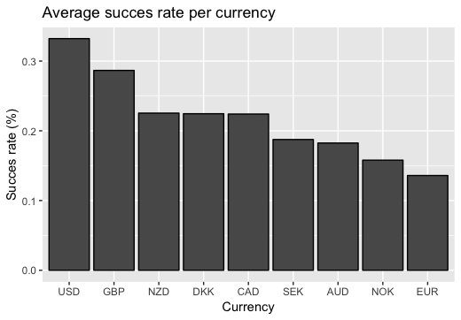

```{r setup, include=FALSE}
knitr::opts_chunk$set(echo = TRUE)
```


# 1. Overview:

The goal of this report is to explain how data science techniques can be applied to predict the scucces of kickstarter projects.

The data set in question was found on Kaggle under the following name: "*Funding Successful Projects on Kickstarter, Predict if a project will get successfully funded or not using labeled data*" (https://www.kaggle.com/codename007/funding-successful-projects). Kickstarter is a crowd funding platform where projects are presented and request funding from individuals. If the funding goal is met (i.e. the project is succesfull), the project owner gets the funds. If the goal is not met, the owner gets nothing. The question put out is to predict when a project will be funded. The package that can be downloaded form the website contains three files: train.csv, test.csv and sample_submission.csv. Of these three only the train.csv is used for machine learning purposes. The data set contains the metrics of 108 129 projects.

The outset of this project is to build a Machine Learning (ML) model based on the training set that is capable of predicting which projects of the test set will be succesful.

This was done by first analyzing the data to understand the detailed contents of the set. Afterwards some further cleaning is done to make the data set a fully tidy one. The final step is to build a model that will return the predicted ratings and that accounts for different dependencies within the data set. Additional explanations and remarks are given to show why certain choices were made and help to explain the approach and the data set.

*Please note that the markdown file from which this report was generated was written on iOS, which means that when reknitting the markdown files on a Windows or Linux machine some characters might not be displayed correctly. Please refer to the PDF of the report.*

# 2. Analysis: Prediction approach

This chapter will explain the following items:

- exploration of the data set
- further cleaning of the data set
- the model approach

Before the cleaning of the "Kaggle training.csv" set, the "Kaggle test.csv"" set is analysed to see which variables will be available for machine learning.

The data cleaning and analysis that are done are applied to the Kaggle training data set to get a global view on the different metrics. After the analysis of the "Kaggle test.csv" set, it will not be used anymore.

## 2.1 Data exploration & basic cleaning

A first round of superficial data exploration will allow to understand the different variables of the data sets.

### 2.1.1 Kaggle train set basic exploration

The data set has a size of 57.9 Mb and consists of a total of 108 129 projects (rows). There are a total of 14 variables (columns) in the original data set, being: 

- project_id (character): project identification number
- name (character): official name given by the project owner
- desc (character): description of the project by the project owner
- goal (double): amount of money that is to be achieved before the deadline for succes 
- keywords (character): keywords that define the project
- disable_communication (logical): whether or not funders allowed to talk to the project owner(s)
- country (character): country where the project is launched
- currency (character): currency in which the goal is set
- deadline (numerical): date of the deadline to fund the goal
- state_changed_at (numerical): date of the change of the final_status
- created_at (numerical): creation date of the project
- launched_at (numerical): launch date after which funding can be received
- backers_count (numerical): final amount of backers for a project
- final_status (numerical): final status of the project after deadline

### 2.1.2 Kaggle test set basic exploration

The Kaggle train and test sets have identical variables (rows) except for the backers_count and final_status. This is logical as they are typically known only once the deadline is passed and the project is frozen. So the Machine Learning (ML) algorithms will have to predict data while not having these columns. Please do not confuse this set which comes from the test.csv file with the test set that will be created later on.

## 2.1.3 Data cleaning

The first major clean-up is that of the timestamps. The columns state_changed_at, created_at, launched_at and deadline are all in a numeric (integer) notation. This rather difficult to comprehend and therefore the lubridate package was used to translate them into the YMD-HMS format.

The second clean-up is on the keywords. These are all seperated by dashes. In order to have smoother operation and readability later, these dashes are replaced by spaces.

In this section only the most basic data cleaning is explained and performed As the set is further analysed and understood more optimizations/cleaning possibilities will be found and implemented. The data set does not contain any NAs (Not Applicable) or otherwise disruptive entries.

### 2.1.4 In depth data exploration

By doing some basic data exploration the following insights can be obtained:

- The overall average succes rate of a project of the data set is 31.96 %
- The first project was created on the 21st of April 2009 and the last deadline fell on the 31st of May 2015
- The average time between launching of a project and its deadline is 34 days with a minimum of 1 day and a maximum of 92 days
- By looking at the figure below, it can be deduced that different projects can have very different timelines. Some have low delta between launch and creation. Other projects have a state change before the end of the deadline, which means that the funding goal was achieved before the time was up. A project timeline can be interpreted as a vertical line on the figure below which passes through the four plotted lines.

```{r timelines, echo=FALSE, out.width = '70%', fig.align = 'center'}

```

- There are 323 projects that have the communication disabled. By looking at the final status it is clear that no projects with disabled communication have passed.
- Projects are created in 11 different countries: US (United States), GB (Great Brittain), CA (Canada), AU (Australia), NZ (New-Zealand), NL (Netherlands), SE (Sweden), IE (Ireland), NO (Norway), DK (Denemark) and DE (Germany). The succes rate per country and the amount of projects per country are shown in the table below.

```{r country_tab, echo = FALSE}
tabl <-
"
country succes count
US       0.332 92033
GB       0.287  8758
NZ       0.225   355
DK       0.224   196
CA       0.224  3736
IE       0.207   111
SE       0.188   240
AU       0.182  1880
NO       0.158   114
NL       0.125   705
DE       0         1
"
cat(tabl)
```

- Projects have goals in 9 different currencies being: USD (US dollars), GBP (Pound Sterling), CAD (Canadian Dollars), AUD (Australian Dollars), NZD (New Zealand Dollars), EUR (Euro), NOK (Norwegian Krones) and DKK (Danish Krones). The succes rate per currency is shown in the plot below.
```{r currencies, echo=FALSE, out.width = '70%', fig.align = 'center'}

```

Four items that deserve a more in-depth analysis are the backers_count, the relationship between currency and country, the goals and the text variables.

#### 2.1.4.1 Backers analysis

While the backers_count variable will not be used in the ML, it is interesting to quickly look at its metrics to gather some more insight. 
The minimal amount of backers for a project is 0 and the maximal amount is 219382. The entire data set has a total of 13 355 733 backers, or 124 backers per project on average. Not every backer counted is a unique person, some persons will back multiple projects. 

The figure below shows how the amount of backers influences the succes rate. It is clear that as the amount of backers increases, so does the succes rate until it approaches a succes rate of 1 for more than 10 000 backers.

```{r backers, echo=FALSE, out.width = '60%', fig.align = 'center'}

```

However, not many projects achieve this cap of more than 10 000 backers. When looking at the histogram below, it is clear that the vast majority of projects have between 0 and 200 backers. The higher count at 1000 backers is the total sum of amount of projects that have more than 1000 backers.

```{r backers_hist, echo=FALSE, out.width = '60%', fig.align = 'center'}

```

#### 2.1.4.2 Currency and country

By listing the used currencies per country from which the project originated, the relationship between these two variables can be examined.

```{r concur, echo = FALSE}
tabl <-
"
Country        | US  |GB  |CA  |AU  |NZ  |NL  |SE  |IE  |NO  |DK  |DE |
Currencies used| USD |GBP |CAD |AUD |NZD |EUR |SEK |EUR |NOK |DKK |EUR|
"
cat(tabl)
```
Every country uses one currency and NL, IE and DE use the same currency, the Euro. The Euro is only used in 817 out of the 108 129 projects. Based on this it can be argued that both the country and currency will carry practically the same information and in order to go to a tidy data set only one will be preserved. The choice is made to keep the currency as it regroups the three small country contibutors being NL, IE and DE.

#### 2.1.4.3 Goals analysis

When looking at the kickstarter site, it becomes clear that every goal is set in the currency chosen by the project owner. Therefore, in order to analyse the goals variable, the first step is to recalculate every goal to the same currency. The USD was chosen as currency as it is the most used in this project and also a global reference in regular economics. The rates vs USD for every currency that is used in the R-file were taken on 29 May 2019 from Google, and are as follows:

```{r rates, echo = FALSE}
tabl <-
"
Currency        | USD |GBP |CAD  |AUD  |NZD |EUR  |SEK  |NO  |DK  |
rate            | 1   |1.27|0.74 |0.69 |0.65|1.12 |0.10 |0.11|0.15|
"
cat(tabl)
```

Now that every goal is in the same currency, it can be further quantified. The minimal goal is 0.01 USD, the maximum is 100 000 000 USD and the average goal is 34 784 USD. The images below show the distribution (histogram) and the succes rate per interval.

```{r hist_goals, echo=FALSE, out.width = '60%', fig.align = 'center'}

```

```{r goal_vs_rate, echo=FALSE, out.width = '60%', fig.align = 'center'}

```

The histogram shows that the majority of projects (about 80 000) have a goal lower than 10 000 USD. The succes rate vs interval shows that projects with goals that are lower than 10 000 dollars have the highest succes rate and that as the goal increases, the succes rate drops and stabilizes at about 0.14.

#2.1.4.4 Text analysis

The kickstarter data set contains three columns with characters per project:

- The name variable shows the project name
- The description contains the complete description of the project in varying detail
- Keywords shows the characterising words the project owner has used to define the project

As the name of a project can be rather unique and has a lot of unkown words and possibly trademarked terms, this column will not be used further. 

By looking at the first six entries of the description, it is clear that different owners have filled these out very differently. Investigating the amount of characters for the first 20 projects also shows that there is a large degree of variety within the length of the description. Due to the variability of description content, its length and the fact that there is already a variable containing the characterising words of a project, this will also not be used further.

The keywords column has a lot of potential as it contains just a few words that describe the project, so the analysis will be continued on this variable. It should be noted that the keywords and name columns look to be very similar but are not for all projects.

While the entire kickstarter train data set has a size of 57.9 Mb, the three columns name, desc and keywords account for 42.6 Mb or 73% of the memory. Optimising the way they are used for machine learning will greatly help the computational effort required to get results.

One way to do this is to condense the columns into less information. For this project it was chosen to take the keywords column and extract the most characterising word per project. This way some simple text mining and machine learning can be applied on words . The first step is to unnest the words and then count the occurences in all projects and their succes rate (proportion of projects that have the word as keyword that pass & total amount of projects that have the word as keyword). Stop words are removed and the remaining ones are then ranked on occurence and only the words with a count higher than 650 are taken (see the table below for an example of the 6 most occuring words). This is a limit that was arbitrarily chosen to limit the amount of top_words an they account for 54 421 occurences. For every project, the highest ranked word was found and used to categorise the project. If the highest ranked word did not feature in the look-up table, then a filler word "other" was used to categorise. Now the top_word column containts the highest ranked, catagorising word per vector, has a size of only 4.6 Mb and can be used for machine learning. Below are the 6 most used words with their count (n), succes rate and rank.

```{r top_words, echo = FALSE}
tabl <-
"
   word    n            succes rank
  album 5546 0.435629282365669    1
project 3731 0.300187617260788    2
   film 3571 0.446373564827779    3
   book 2721 0.310180080852628    4
    art 2536 0.295347003154574    5
      0 2509 0.344360302909526    6
"
cat(tabl)
```


## 2.2 Method analysis

The goal of the written code is to predict whether or not a project will be succesful based on the variables that are available in the test set: project _id, name, desc, goal, keywords, disable_communication, country, currency, deadline, state_changed_at, created_at and launched_at. As the goal is to predict a succes or fail, the outcome will be a classification and more precisely a binomial classification. This limits the use of alorithms that are more keyed towards regression (which predict continuous, or multi leveled outcomes).

By looking at the most commonly used algorithms, two were identified to be useful for this exercise: Generalised Linear Models (GLM) and Support vector Machines (SVM). First an average succes rate model will be used and later compared to both other machine learning models. In the end the most suited model with its parameters will be chosen and explained.

### 2.2.1 Creating training and test set with the appropriate variables

As explained above, there are variables in the kickstarter set that have too much or irrelevant information. The following variables will be removed for the following reason:

- project_id -> only usefull for identification
- goal -> replaced by rate_goal so that all goals are in USD
- name, desc, keywords -> replaced by top_word which categorises the project 
- country -> replaced by currency as it contains practically the same information
- backers_count -> not a variable that is known before the deadline or in the Kaggle test set
- state_changed_at, created_at, deadline, launched_delta, state_delta -> replaced by two variables: launched_at and deadline delta (time from launch till deadline)

The first step before being able to apply machine learning to the data set is to divide it into a training and testing set. This is done by the code with the training set having 90% of all the observations and the test set having 10% of the observations.

### 2.2.3 Average succes model

The first and simplest model which is applied to the data set is to predict a pass or fail with a succes rate which is equal to the average succes rate of the training data set, which is 31.97%. This is done by construction a vector containing 0 and 1 (where 0 = fail and 1 = pass), and sampling out of these with replacement and probablity of 1 being $p_1=0.3197$ and the probability of 0 being $p_0 = 1-0.3197 = 0.6803$. The resulting confusion matrix is shown below and the total accuracy of this instance is accuracy=0.5058, with a sensitivity=0.5041 and a specificity=0.5093. Rerunning this model with a different $set.seed()$ will result in different accuracies all floating around 0.49 - 0.50.

```{r average_model, echo = FALSE}
tabl <-
"
y_hat_avg    0    1
        0 3714 1691
        1 3653 1755
"
cat(tabl)
```

It is clear that having an accuracy of 0.5 is not sufficient and needs to be improved further. Therefore the GLM and SVM machine learning algorithms will be applied.

### 2.2.4 GLM modelling

The first machine learning algorithm which will be used on the training set is the genearlized linear model. It is based on the linear model which is used for regression ML. The goal is to predict values for the test set by defining a function that when used will be a linear combination of different predictors. As the data set has categorical data (currency, top_word, etc.) the model will use logistic transformation rather than linear. The $glm()$ function is used with its family set to binomial. The family defines the link between the input and outputs, so choosing one that fits these in real life will help with optimizing the final output. 

Before directly running the model on the enire data set, a smaller sample set of 5000 observations was taken to test the metrics. Once this sample ran, the entire model was subjected to the model fitting. The two accuracy are quite different due to the full training set having more observations and thus the algorithm as capable of better fitting the model.

The overall accuracy = 0.6809 with a very high sensitivity = 0.9837 and a low specificity = 0.0337. The figure below shows the importance of variables in descending order. It is clear that the first 5 variables control the majority of the model.
```{r glm_varimp, echo=FALSE, out.width = '60%', fig.align = 'center'}

```

As the fitted GLM model returns doubles (digits) for the different observations rather than 0 (fail) or 1 (pass), these have to be transformed to the respective 0 or 1. In the code this is done by an ifelse statement that makes an observation 0 if it is smaller than the cut-off of 0.5 and 1 if it is larger than 0.5. This cut-off can be modified and different results will be obtained. The figure below show the resulting accuracy, sensitivity and specificity curves for varying cut-offs going from 0.01 to 0.67.
```{r cut_off, echo=FALSE, out.width = '60%', fig.align = 'center'}

```

The accuracy stabelizes for values above 0.5 and is highest at these values.

### 2.2.5 SVM modelling

The second machine learning algorithm that will be used is named support vector machine. Its goal is to create a hyperplane (which is a feature that has one dimension less than its surroundings) to divide between categories. For a data set with $n$ variables, SVM will try to fit a $n-1$ hyperplane to differentiate between outcomes. So if two variables are given, these create a two dimensional space in which the SVM will try to differentiate between the different outcomes by creating a hyperplane (a line in this case) to separate the variables. 

This algorithm is recommended for its power in fitting non-linear models as hyperplanes and accurate application to data sets with categorical outcomes. The main disadvantage of this algorithm is that it is computationally very intensive especially for larger data sets with lots of variables. Also, it is very difficult to interpret this algorithm with lots of variables as the visualization in dimensions higher than 3 is not possible.

When looking at the $svm()$ help, there are two arguments which appear to influence the outcome of the model fitting a lot: the type and kernel. The type indicates if the SVM model needs to be used for classification, regression or novelty detection. Since this set needs only classification (1 or 0), the "C-classification" and "nu-classification" are the only possiblities. However, the difference between these two is that for nu-classification results have to be an element of the interval $[0,1]$, while the C-classification can have values outside of this. Due to the bigger flexibility of the C-classification, it will be used in this model.

The kernel argument tells the model what the form is of the dividing plane between categories (hyperplane) that should be fitted. The options are linear, polynomial, radial basis and sigmoid. These four will all be tested to find the most optimal kernel. As with the GLM model, the fitting is done first by using a data set of 5000 observations to see whether the code written runs correctly without errors. When the model was being run with the limited 5000 obervations and all the variables, the computational effort required to fit the model was too high and crashed the program. Therefore, it was chosen to drop the top_word variable from the data set to achieve a result. The following table shows the resulting accuracy of the different kernels for 5000 observations.

&nbsp;

```{r kernels_thou, echo = FALSE}
tabl <-
"
   kernels  accuracy
----------------------
    linear 0.6813095
polynomial 0.5920651
    radial 0.6813095
   sigmoid 0.4307778
"
cat(tabl)
```

It is clear that the linear and radial kernels provide the highest accuracy. However, as the code runs correctly on a limited set, and the GLM model accuracy switched between limited and full set, the next step is to apply the kernel investigation on the full training set.

The accuracy has clearly gone up when looking at the matrix of the accuracies for the full training set as shown in the table below.
```{r kernels, echo = FALSE}
tabl <-
"
   kernels accuracy
----------------------
    linear 0.6813095
polynomial 0.6813095
    radial 0.6813095
   sigmoid 0.5731064
"
cat(tabl)
```

# 3. Results

In this section the results will be discussed in-depth. The table below will be used as basis for discussion. In order to easily interpret the results, the standpoint of a venture capitalist will be taken. This person wants to see which model is most capable of telling him which projects will be successful so that he can know in which ones to invest. Three metrics are established for the venture capitalist: 

- Neutral are projects in which he does not invest
- Wins are projects in which he invests and are successful
- Losses are projects in which he invests but which are not sucessful.

```{r CF_overview, echo = FALSE}
tabl <-
"
type     A    B    C    D    accuracy sensitivity specificity neutral  win loss
-------------------------------------------------------------------------------
 average 3714 1691 3653 1755     0.51        0.51        0.50    5405 1755 3653
     glm 7247 3330  120  116     0.68        0.03        0.98   10577  116  120
 svm lin 7367 3446    0    0     0.68        0.00        1.00   10813    0    0
svm poly 7367 3446    0    0     0.68        0.00        1.00   10813    0    0
 svm rad 7367 3446    0    0     0.68        0.00        1.00   10813    0    0
 svm_sig 5071 2320 2296 1126     0.57        0.33        0.68    7391 1126 2296
"
cat(tabl)
```
A project is succesful if the outcome is 1 and a fail if the outcome is 0. The A, B, C and D variables are indexes of the 2x2 confusion matrix where:

- A is a predicted fail for a reference fail
- B is a predicted fail for a reference pass
- C is a predicted pass for a reference fail
- D is a predicted pass for a reference pass

Neutral is the sum of A and B, win is the column D and loss is the column C.

By looking at the accuracy metrics, the results indicate that the SVM linear kernel, SVM polynomial kernel and SVM radial kernel return the best results. However, when looking at the sensitivity and specificity it is clear that these are very different for these models. The highest accuracy models always predict a 0, which means that the accuracy of 0.68 is "1 - average succes rating of all projects in the test data (0.32)". There are also no wins or losses as the model never predicts a 1, so not telling the venture capitalist to invest in a project. The GLM differs slightly from these three as it predicts a very low amounts of passes.

When looking at the table of accuracy for kernels fitted on the data set for 5000 observations, the polynomial kernel has an accuracy of 0.59, which is lower from the one it achieved when having the full data set to fit. However, the sensitivity and specificity are a lot more balanced for the 5000 observations being respectivly 0.45 and 0.66. From this it is concluded that these models with 0.68 accuracy are actually over-fitted to predict only zeros (fails). While this yields the highest accuracy, it is of course not sufficiently nuanced and not useful for a real life application, as the venture capitalist would never invest in anything when following these models.

The two remaining models: average succes and SVM sigmoidal, have a respective accuracy of 0.51 and 0.57. These are a lot lower than the other four models but they predict both zero's and one's. When looking at the average succes model it yields way more losses than wins, which is not desireable. The GLM also yields more losses than wins but the margin is very small. However, neither of the two models can really be used to tell a venture capitalist what project to invest into as they both have more losses than wins.

In order to deliver a better working model to the venture capitalist the SVM model could be optimised by tuning the cost and gamma parameters. These were set to their default value in the $svm()$ function. However, optimizing these even for only the 5000 observations can take from 3 to > 10 hours, depending on the size of the tunegrid which is chosen. It will only grow a lot bigger for the full test set. Hence why it was not done in this project. Another option is to use other techniques which will counteract the overfitting.

For the GLM model, more in-depth analyses and tweaking of the variable importance could further improve the model. If this improvement results in optimising sensitivity and specificity ratings, the wins vs losses can be shifted and the model will be better suited for the venture capitalist.

A last alternative is to employ other machine learning algorithms or to make an ensemble of different algorithms. For the ensemble, algorithms need to be chosen which are capable of taking the different types of variables and return the pass or fail result.

Please note that for the wins & losses, the average potential gain per project is assumed to be equal over all projects. This is a simplification of real life.

# 4. Conclusion

The outset of this project was to analyse the kickstarter data set, clean it and apply machine learning algorithms to predict which projects will pass and which will not.

The first step of this project was to analyse the variables of the used data (train.csv) set and the "Kaggle test.csv" data set. This was followed by an in-depth investigation of the different variables of the data set. Lastly, the variables were transformed in a tidy set by further cleaning in order to achieve more comprehension of the content and construction of the different variables.

Afterwards, the kickstarter data set was divided into a training and test set. Six different models were applied to predict the outcome of the test set: average succes, GLM, SVM linear, SVM polynomial, SVM radial and SVM sigmoid. While the linear, polynomial and radial SVM models had an accuracy of 0.68, the further investigation in the results section showed that a venture capitalist wanting to use the models to decide in which project to invest his money, will not be able to make a profit using any of these. The reason is that these three models are biased to exclusively predict fails and not succes, and so the venture capitalist would never invest money. 

The three remaining models did predict succeses so the venture capitalist could use them. However, the returned results by the average succes and SVM sigmoid models yield a large amount of losses. The SVM linear has a high precision and also predicts win & loss with a low bias to loss. So out of all the models created, this would be the best one to use.

As shown above, the best model had a low occurence of predicted successful projects with a bias towards loss on this prediction. Further improvements can be achieved by:

- Improving the variable weights of the GLM model
- Using a tunegrid to modify the cost and gamma parameters of the SVM models (very computationally intensive) together with other techniques to counteract the bias to predicting fail
- Trying other ML algorithms or an ensemble to achieve better accuracy and win/loss ratios, while keeping in mind the present inputs and outputs required of the models

