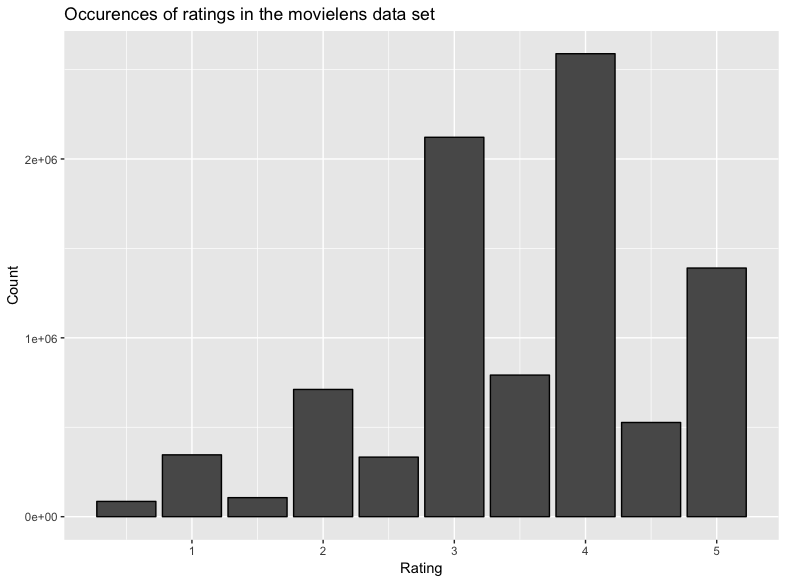
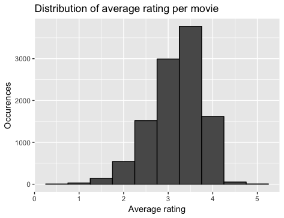
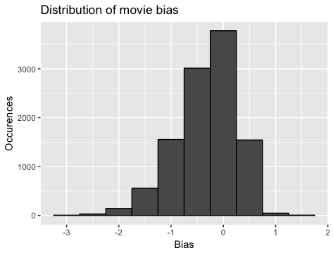
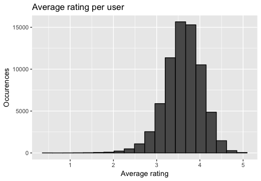
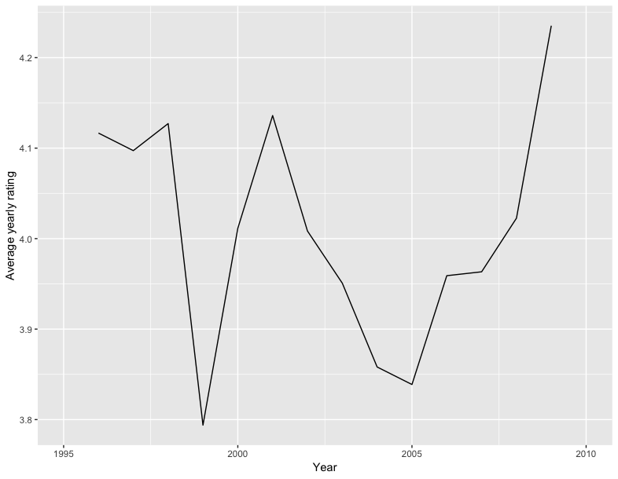

```{r setup, include=FALSE}
knitr::opts_chunk$set(echo = TRUE)
```


# 1. Overview:

The goal of this report is to explain how data science techniques can be applied to predict movie ratings from the movie lens data set. 

The data set was built from the "MovieLens20M" that is publicaly available on *grouplens.org*. The 20M set contains 20 million ratings by 138 000 users of 27 000 movies. However, a cleaned up version of this set was received from the course. This cleaned up set, further referred to as the base set, consists of less ratings (around 10 million) and has 6 columns: user id, movie id, rating, timestamp, title and genres. It has been divided into a test and validation set (data frames named *edx* and *validation* respectively in the code). The test set is used by the model to learn and the prediction set is used to compare the predicted values to actual values.

The goal of this project is to achieve a typical error loss with the Root Means Square Error (RMSE) between the predicted values and the validation values which is lower than 0,8775. The predicted values are obtained by building a model based on the test set and applying the model on the data from validation to predict the validation ratings.

This was done by first analyzing the data to understand the detailed contents of the set. Afterwards some further cleaning is done to make the data set a fully tidy one. The final step is to build a model that will return the predicted ratings and that accounts for different dependencies within the data set. Additional explanations and remarks are given to show why certain choices were made and help to explain the approach and the data set.

*Please note that the markdown file from which this report was generated was written on iOS, which means that when reknitting the markdown files on a Windows or Linux machine some characters might not be displayed correctly. Please refer to the PDF of the report.*

# 2. Analysis: Prediction approach

This chapter will explain the following items:

- further cleaning of the data set
- exploration of the data set
- the model approach

The data cleaning and analysis that is done in the first two sections will only be applied to the testing set. This is because, as explained earlier, the validation set is used only to check the eventual predicted values.

## 2.1 Data preparation

Both sets have 6 columns:  userId, movieID,  rating, timestamp, title and genres.
A total of 9 000 055 observations are available in the test data set. While the data is already rather condensed to the essentials, we cannot call it tidy if the goal is to predict the rating per movie. Tidy data implies that each variable is a column and each row is an observation. Since the movieId and title  will have the same information for every movie, and the question is to optimize the movie rating prediction, one of these two columns can be put aside. 
For this application the choice was made to only keep the movieId in the data sets as this is an integer which will take less memory and calculating power to use than the string of the title. While the genre is also the same per movieId, it is kept as further data exploration might show that there are genre-effects that might help optimize the machine learning.

Now the remaining data set is tidy as every column is a variable (user, movie, time and genre) and every row is an observation.

## 2.2 Data exploration

By doing some basic data exploration the following insights can be seen:

- The data set before tidying consists of 9 000 055 observations (rows) and six variables (columns), where every observation is a rating
- Ratings are be between 0,5 and 5 with increments of 0,5.
- No zeros were given as a rating and the following plot shows the amount of times each rating was given across the entire data set
```{r occurence, echo=FALSE, out.width = '70%', fig.align = 'center'}

```
- From the graph it can also be seen that full star ratings (i.e. 1, 2, 3, 4, 5) are given much more frequently than half star ratings (0,5; 1,5; 2,5; 3,5; 4,5)
- There are a total of 10 677 unique movie ratings in the data set, even though the highest movieId was 65133. 
- The total amount of users that have given a rating was 69 878, with the highest amount of ratings for one user being 6616.

## 2.3 Method analysis

The goal of the written code is to predict the movie ratings for every user with minimal error. One way to achieve this is to start with a rather simple model and to improve its accuracy by finding and accounting for different effects which influence the prediction.

### 2.3.1 Mean model

 The simplest model that can be made is to predict the same rating for every movie and every individual. A good value to choose would be the average rating for all the movies. When doing this, the RMSE can be calculated by using the following formula:

$RMSE= \sqrt{\frac{1}{N}  \sum((y-y_{hat})^2)}$

Where $y$ is the actual value of the observation that we want to predict and $y_{hat}$ is the predicted value for that observation. When running this calculation on the given data sets the formula can be rewritten as:

$RMSE= \sqrt{\frac{1}{N} \sum_{i=1}^n((mean-validation\$rating_i)^2)}$

The average rating for all the observations in the data set is 3,51. Plugging this value into the line above gives 1,06 as a result. So by predicting the rating of every movie as the general mean of the test data set, the root mean square error is 1,06. This is still a lot higher than the goal of 0,8775, which means that the model will need to be refined further.

```{r varying, echo=FALSE, out.width = '60%', fig.align = 'center'}
knitr::include_graphics("rmse_various_ratings.png")
```

To prove that the mean of all the ratings is the best value to use, the RMSE was calculated for every rating between 0,5 and 5 with a step of 0,1. The output is shown in the image above and it can clearly be seen that the RMSE is minimal around the average of all movie ratings (about 3,5).

### 2.3.2 Movie bias model

As mentioned before, the data is tidy which means that each row is an observation and each column a variable. The logical next step in the model based approach is to start compensating the effects that are seen in the different columns. 

The first column or varying factor that will be looked at is the movieId column. The following plot shows the distribution of the average movie rating.
```{r avg_rating, echo=FALSE, out.width = '50%', fig.align = 'center'}

```

This indicates that different movies have different ratings, which is logical as some movies are more liked (read popular) than others.

The predicted rating for any given movie can be denoted as $Y_i$ where $i$ indicates the movie id. So the formula which describes the predicted $Y_i$ with the average rating ($\mu$) and the movie dependent bias ($b_i$) is:

$Y_i= \mu + b_i$

The movie bias is the difference between the average rating of each movie and the average rating of the entire training data set. The next step is to calculate the bias for every movie. This is done by first grouping all the observations per movie, averaging these and then subtracting the overall mean. The distribution of the bias per movie is shown in the graph below. It is worth noting that this plot has the same shape as the one directly above, as the only difference is that the overall rating average has been subtracted.

```{r bias_dist, echo=FALSE, out.width = '50%', fig.align = 'center'}

```

When calculating the RMSE for the biased predictions using the formula, the resulting value is 0,94. This is an improvement over the first values of 1,06. The increased accuracy indicates that optimizing the model by compensating for different effects (i.e. columns) is a good way to build a reliable model. 

### 2.3.3 User bias model

The next column which will be looked at is the user column. This is because different people are more inclined to give higher ratings than others. To show this variation, the overall average rating per user of the users that have rated more than 100 movies is shown below.

```{r user_bias, echo=FALSE, out.width = '50%', fig.align = 'center'}

```

Similar to the movie effect, this user effect can also be accounted for with a bias, $b_u$. So the formula from above can be expanded by adding this variable to create:

$Y_{i,u}= b_i + b_u +  \mu$

It is worth noting that the predicted value $Y_{i,u}$ now has the subscripts $i$ (movie id) and $u$ (user id) and thus varies with both of these. 

Now the model can again be used to calculate the predicted rating. The resulting RMSE of this calculation is 0,865.

# 3. Results

As shown earlier, the ratings can be predicted with a sufficient accuracy by accounting for only the user and movie bias. The evolution of the RMSE by starting from predicting the average rating for every movie until the final model is shown in the table below:

```{r results, echo = FALSE}
tabl <- "| Model                 | RMSE          |
|-----------------------|---------------|
| Overall average       | 1.061         |
| movie bias            | 0.944         |
| user and movie bias   | 0.865         |
"
cat(tabl)
```

While the result is sufficient for the requested RMSE, it should be noted that further optimizations are still possible. The data set still has two unexplored columns being the genre and the timestamp.

Users that like certain genres will also get a positive bias when presented with similar genres or a negative bias with a totally different genre such as romance and horror. This effect is shown by looking at the rating distribution of the userId with the highest count of ratings given. The table below shows the three highest rated genres by this user and contains the main genre, the average rating for the genre and the amount of movies that were rated for this genre by this specific user. Genres that were rated less than 100 times are not shown in this table.
```
   genres      avg_rating count
 1 Film-Noir         3.69   112
 2 War               3.49   344
 3 Animation         3.47   132
```

The data indicates that the user clearly has a tendency to rate  certain movie genres (film-noir, war, animation) higher than others. By filtering out genres that have less than 100 rating counts, the variability coming from movie bias within a genre for a user is limited.

The timestamps can be used to make a time variant prediction of the rating, as the rating for a certain movie can shift in time depending on the way it is perceived. An example of this is the movie "Forrest Gump" which has an overall average rating off 4.01. However, when looking at the average rating of the movie per year, we see that there are years such as 1999 and 2005 in which the movie scored a lot below its average, and other years where it scored a lot better. Whatever the sociopolitical reason for these variations might be, accounting for it is a potential improvement for the prediction model.

As the model suffised for the required RMSE without the genre and timestamp variations accounted for, the data can further be cleaned to have less information by removing these two rows. However, even with these two present and not used, the data remains tidy.

```{r time_var, echo=FALSE, out.width = '60%', fig.align = 'center',fig.pos="H"}

```

There are still other modifications which could be coupled to the model to achieve even better accuracy such as "regularization". However the improvement of these is marginal and the outset has already been achieved, so these will not be discussed.

Lastly, while the model used to achieve the RMSE value was trained closely by hand and the result was obtained, there are a variety of different ways to achieve an equal or even greater prediction accuracy with lower RMSE. There is a vast amount of different machine learning algorithms that will yield better or worse results when applied to this data set, depending on their approach. Due to the limited scope of this project and the achievement of the requested result, this will not be diverged upon. 

# 4. Conclusion

The outset of this project was to predict the ratings of movies with a root mean square error that is lower than 0,8775. The final model yielded a RMSE of 0,865 so the outset is achieved.

The first step was to clean up the data by removing the movie titles and putting them in a separate column linked to the movienames for future reference. Afterwards, the data was analysed to provide some basic insights in how the set was constructed and what its contents mainly consisted of.

The next step was to start creating the model used to predict the ratings. The initial prediction was done by taking one fixed value as prediction for every movie. The average rating was taken and this resulted in a RMSE that was too high. It was also shown that the average rating gave the lowest RMSE for all fixed values from 0,5 to 5. The following step was to explain the influence of different movies on ratings. This was then accounted for in the model with the movie bias variable and it resulted in a much lower RMSE, but still above the target. Lastly, the user preference influence on the ratings was explained and accounted for in the model by adding the user bias variable. The final RMSE that was obtained with this model was 0,865, which is below the target of 0,8775.

Two final remarks can be made:

- While the result is below target, there is still some further optimization possible of the RMSE. Techniques such as regularization and adding another bias that is time dependent and/or genre dependent can achieve this.
- The model based approach explained in this report and in the code is one of many ways that can be used to predict the ratings. Other techniques will give different results which might be lower or higher, depending on how well the technique is adaptable to this data set.
